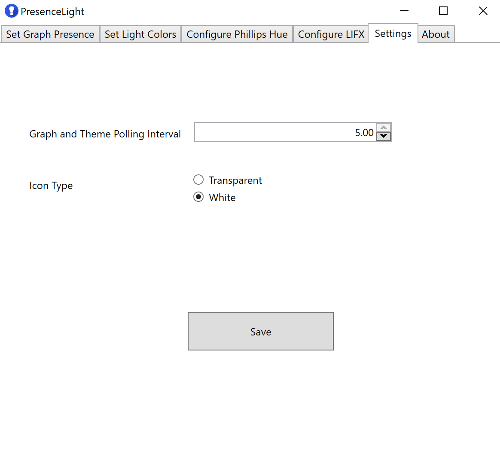

# Presence Light

### Stable WPF Installs

| Persona | Build Number | Link |
|--- | ------------ | ---- |
| Microsoft Users | | [Install](https://presencelight.z5.web.core.windows.net/MSFT/)
| Other Users | | [Install](https://presencelight.z5.web.core.windows.net/Prod/)

## What is Presence Light?

Presence Light is a solution to broadcast your Microsoft Teams presence to a Phillips Hue or LIFX light bulb. There are other solutions that do something similar, but they require a tethered solution (plugging a light into a computer via USB). What Presence Light does is leverage the [Presence Api](https://docs.microsoft.com/graph/api/presence-get), which is available in [Microsoft Graph](https://docs.microsoft.com/graph/overview), allowing to retrieve your presence without having to be tethered. This could potentially allow someone to update the light bulb from a remote machine they do not use.

### [Demo of Presence Light](https://youtu.be/nQbjKXxKlHU)

## Hardware Requirements

| Item  |
| ------------ |
| [Phillips Hue Bridge](https://www2.meethue.com/en-us/p/hue-bridge/046677458478)
| [Phillips Hue Light Bulb](https://www2.meethue.com/en-us/p/hue-white-and-color-ambiance-1-pack-e26/046677548483) |
| [Any LIFX Light](https://www.lifx.com/pages/all-products) |

## Hue HW Notes

You will need the above items to broadcast your presence to. One of the requirements of the Bridge is that it needs to be hard-wired to an internet connection via ethernet, so it will need to be placed close to a router or network switch. There are steps to setup the bridge and bulb in the [Hardware and Connectivity Section](https://www2.meethue.com/en-us/support/hardware-and-connectivity) of the Phillips Support Site, but you should be able to just plug the bridge, wait for the lights to light up, get the IP address for the bridge, enter it into the app, and register the device. The app will register your device, create an account to interact with the bulbs, and finally add any bulbs it finds.

## LIFX HW Notes

LIFX Bulbs can be connected to over [LAN Protocol](https://lan.developer.lifx.com/), or [Cloud Api](https://lifx.readme.io/docs). Presence Light uses the Cloud, which requires getting an Api Key from the [developer portal](https://cloud.lifx.com/settings). Putting that key in Presence Light will enable all connected lights.

## Setting Up the App

**NOTE: These steps are for the WPF (Windows desktop client) application. If you want to get Presence Light working on non-Windows, I am working on a cross-platform solution using .NET Core**

In order for the desktop app to work, you need to be running Windows 10, version 1903 (19H1), as well as provide the following steps.

- Configure an Azure Active Directory Application
- Obtain the IP Address for your Phillips Hue Bridge
- Enable [side-loading apps in Windows 10](https://docs.microsoft.com/en-us/windows/application-management/sideload-apps-in-windows-10)
- Install a User Certificate for the WPF App (included at URL of Installer)
- Install App via the Blue Button

**ANOTHER NOTE: If you are a Microsoft Employee, you do not need to register an AAD Application, as I have done this, I have an [installer](https://presencelight.z5.web.core.windows.net/MSFT) for you to use.**

## Configure an Azure Active Directory Application

1. Sign in to the [Azure portal](https://portal.azure.com) using either a work or school account or a personal Microsoft account.
1. If your account gives you access to more than one tenant, select your account in the top right corner, and set your portal session to the desired Azure AD tenant
   (using **Switch Directory**).
1. In the left-hand navigation pane, select the **Azure Active Directory** service, and then select **App registrations**.

#### Register the client app (WpfApp)

1. Navigate to the Microsoft identity platform for developers [App registrations](https://go.microsoft.com/fwlink/?linkid=2083908) page.
1. Select **New registration**.
   - In the **Name** section, enter a meaningful application name that will be displayed to users of the app, for example `Presence Light`.
   - In the **Supported account types** section, select **Accounts in any organizational directory and personal Microsoft accounts (e.g. Skype, Xbox, Outlook.com)**.
    - Select **Register** to create the application.
1. On the app **Overview** page, find the **Application (client) ID** value and record it for later. You'll need it to configure the Visual Studio configuration file for this project.
1. In the list of pages for the app, select **Authentication**.
  1. In the **Redirect URIs** list, under **Suggested Redirect URIs for public clients (mobile, desktop)** be sure to add https://login.microsoftonline.com/common/oauth2/nativeclient.
   1. Select **Save**.
1. Configure Permissions for your application. To that extent in the list of pages click on **API permissions**
   - click the **Add a permission** button and then,
   - Ensure that the **Microsoft APIs** tab is selected
   - In the *Commonly used Microsoft APIs* section, click on **Microsoft Graph**
   - In the **Delegated permissions** section, ensure that the right permissions are checked: **Presence.Read, Presence.Read.All, User.Read, User.Read.All**. Use the search box if necessary. It should look like this

   

#### Configure the code to use your application's coordinates

1. Collect the Application ID and Tenant ID from your newly created App

   

### Install App

After you have followed the above steps (enable side-loading, installing the certificate and installing app), you will have be welcomed with a message like this

   

You see this message because there is no Client or Tenant assigned to the application, from here you can take the Ids from above and enter them here

   

Once you have those entered, hit save and the Profile page will change

   

Clicking sign-in will prompt you for a login with your Microsoft 365 credentials, and finally when authenticated, you will be shown your Graph profile image and your presence.

   

The application "polls" the Presence Api every 5 seconds, so it will update based on your Teams presence with a slight delay.

## Customize Icons

One of the features of Presence Light is that you can minimize the app to the icon tray. When you open the app, you will see an icon similar to this.

   

This icon will represent your presence color. There are two "kinds" of icons: Transparent, and White. Here is the transparent icon

   

You can change the icon type in the settings pane.

   

After you change and save, the icon will update in the icon tray.

## Wire Up Phillips Light

To connect Presence Light to Phillips Hue, you can do it 1 of 3 ways

 - Obtain the IP Address of your Phillips Hue Bridge (if you have it)
 - Ask Presence Light to find it for you (may no work in certain network configurations)

 

 Once you have the IP of the bridge, you will need to register a developer account and get an Api Key. This is easily done by clicking the "Register Bridge" button.Clicking the button will popup a window asking you to press the sync button on the bridge, this is needed to register Presence Light to the bridge.

 

 When Presence Light is configured, you will see a dropdown of Hue Bulbs connected to the bridge for you to set your presence to.

 

 ## Done

 At this point Presence Light should be setup. Feel free to file an issue if you have any problems.

## Please Contribute

I welcome all contributions here, as I am no expert in WPF/MSIX things.
