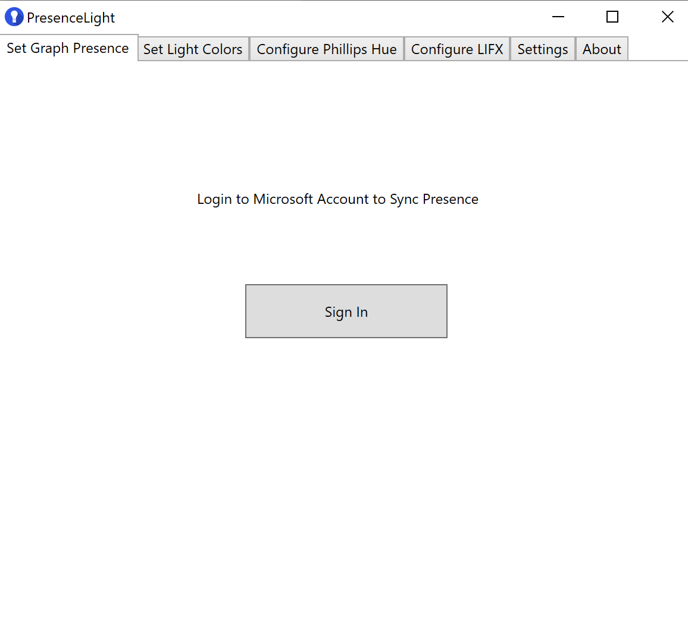

# PresenceLight

### Stable WPF Installs

| Release Channel | Build Number | Link |
|--- | ------------ | ---- |
| Nightly | | [Install](https://presencelight.blob.core.windows.net/nightly/index.html)

## What is PresenceLight?

PresenceLight is a solution to broadcast your various statuses to a Phillips Hue or LIFX light bulb. Some statuses you can broadcast are: your availability in Microsoft Teams, your current Windows 10 theme, and a theme or color of your choosing. There are other solutions that do something similar to sending Teams Availability to a light, but they require a tethered solution (plugging a light into a computer via USB). What PresenceLight does is leverage the [Presence Api](https://docs.microsoft.com/graph/api/presence-get), which is available in [Microsoft Graph](https://docs.microsoft.com/graph/overview), allowing to retrieve your presence without having to be tethered. This could potentially allow someone to update the light bulb from a remote machine they do not use.

### [Demo of PresenceLight](https://youtu.be/nQbjKXxKlHU)

## Hardware Requirements

| Item  |
| ------------ |
| [Phillips Hue Bridge](https://www2.meethue.com/en-us/p/hue-bridge/046677458478)
| [Phillips Hue Light Bulb](https://www2.meethue.com/en-us/p/hue-white-and-color-ambiance-1-pack-e26/046677548483) |
| [Any LIFX Light](https://www.lifx.com/pages/all-products) |

## Hue HW Notes

You will need the above Phillips Hue items to broadcast your presence to, but you can still "use" PresenceLight without them. One of the requirements of the Bridge is that it needs to be hard-wired to an internet connection via ethernet, so it will need to be placed close to a router or network switch. There are steps to setup the bridge and bulb in the [Hardware and Connectivity Section](https://www2.meethue.com/en-us/support/hardware-and-connectivity) of the Phillips Support Site, but you should be able to just plug the bridge, wait for the lights to light up, get the IP address for the bridge, enter it into the app, and register the device. The app will register your device, create an account to interact with the bulbs, and finally add any bulbs it finds.

## LIFX HW Notes

LIFX Bulbs can be connected to over [LAN Protocol](https://lan.developer.lifx.com/), or [Cloud Api](https://lifx.readme.io/docs). PresenceLight uses the Cloud, which requires getting a token from the [developer portal](https://cloud.lifx.com/settings). Putting that token in PresenceLight will enable all connected lights.

## Setting Up the App

**NOTE: These steps are for the WPF (Windows desktop client) application. If you want to get PresenceLight working on non-Windows, I am working on a cross-platform solution using .NET Core**

In order for the desktop app to work, you need to be running Windows 10, version 1903 (19H1), as well as provide the following steps.

- Enable [side-loading apps in Windows 10](https://docs.microsoft.com/en-us/windows/application-management/sideload-apps-in-windows-10)
- Install App via the Nightly Build Link at the top of this page
- Hue Only- Obtain the IP Address for your Phillips Hue Bridge
- LIFX Only - Obtain a LIFX Developer Token from [here](https://cloud.lifx.com/settings)

### Install App

After you have followed the above steps (enable side-loading and installing app), you will have be welcomed with a message like this

   

PresenceLight obtains your Microsoft Teams Availability using a multi-tenant Azure Active Directory Application, meaning you will need to "grant" access to your Presence the first time you use the app. Clicking sign-in will prompt you for a login with your Microsoft 365 credentials, and finally when authenticated, you will be shown your Graph profile image and your presence. If you are curious about what is required to do this on your own tenant, read [Configure an Azure Active Directory Application](https://github.com/isaacrlevin/PresenceLight/wiki/Configure-an-Azure-Active-Directory-Application)

   

The application "polls" the Presence Api at a configured value, whican you can set bewteen 1 and 5 seconds on the Settings page. This means that the light and app will update based on your Teams presence with a slight delay.

### Broadcasting to Lights

There are three main ways to currently update your lights using PresenceLight

 - Updating with Teams Presence (status)
 - Syncing with your Windows 10 Theme
 - Setting a fixed color using color picker

You can only do one of these at a time, so if you for instance are syncing with Teams, choosing anohter option will sign you out of Teams. This will happen with the other options as well.

## Customize Icons

One of the features of PresenceLight is that you can minimize the app to the icon tray. When you open the app, you will see an icon similar to this.

   

This icon will represent your presence color. There are two "kinds" of icons: Transparent, and White. Here is the transparent icon

   

You can change the icon type in the settings pane.

   

After you change and save, the icon will update in the icon tray.

## Wire Up Phillips Light

To connect PresenceLight to Phillips Hue, you can do it 1 of 2 ways

 - Obtain the IP Address of your Phillips Hue Bridge (if you have it)
 - Ask PresenceLight to find it for you (may no work in certain network configurations)

 

Once you have the IP of the bridge, you will need to register a developer account and get an Api Key. This is easily done by clicking the "Register Bridge" button.Clicking the button will popup a window asking you to press the sync button on the bridge, this is needed to register PresenceLight to the bridge.

 

When PresenceLight is configured, you will see a dropdown of Hue Bulbs connected to the bridge for you to set your presence to.

 

## Wire up LIFX

To connect PresenceLight to LIFX colored bulbs, you need to obtain a LIFX Developer Token. When you first arrive at the LIFX tab, you will see a message like this if you try to get Lights or Groups

 

After entering an obtained token, you will be able to get a list of either individual lights or groups of lights, selecting one of the options and saving gives you a message like this

 

## Done

At this point PresenceLight should be setup. Feel free to file an issue if you have any problems.

## Please Contribute

I welcome all contributions here, as I am no expert in WPF/MSIX things.
