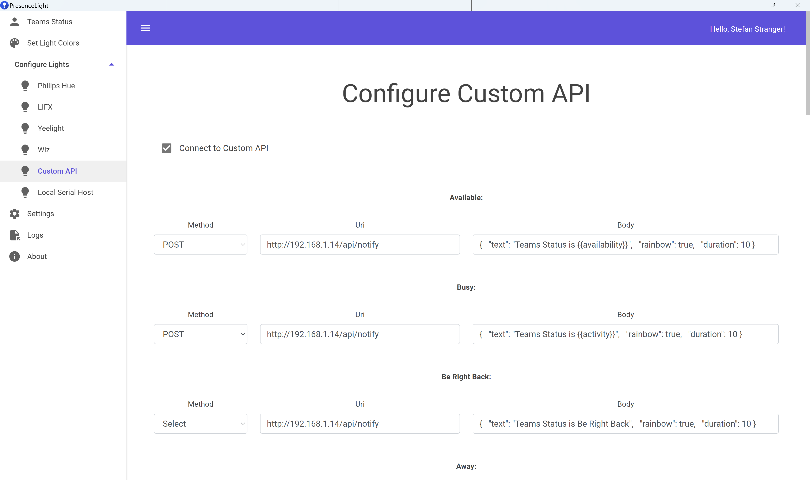

The Custom API page lets you use any generic service which has a web API which accepts GET or POST requests.

For example, IFTTT webhooks can be used to run an action on any IFTTT-integrated service.

In this way IFTTT can act as a bridge to other light services (such as Magic Home / MagicHue) or any other service which you may want to control with your Teams presence, e.g. 'When I'm in do not disturb pause Roomba'.

To connect PresenceLight to a custom API:

Configure the web service (e.g. created the applets in IFTTT)
Enter the corresponding API method and URI against each presence state.

   
