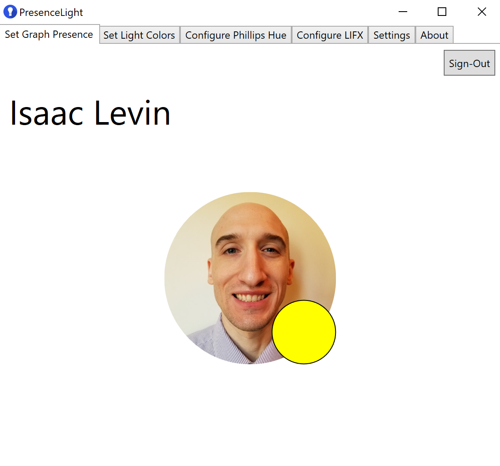
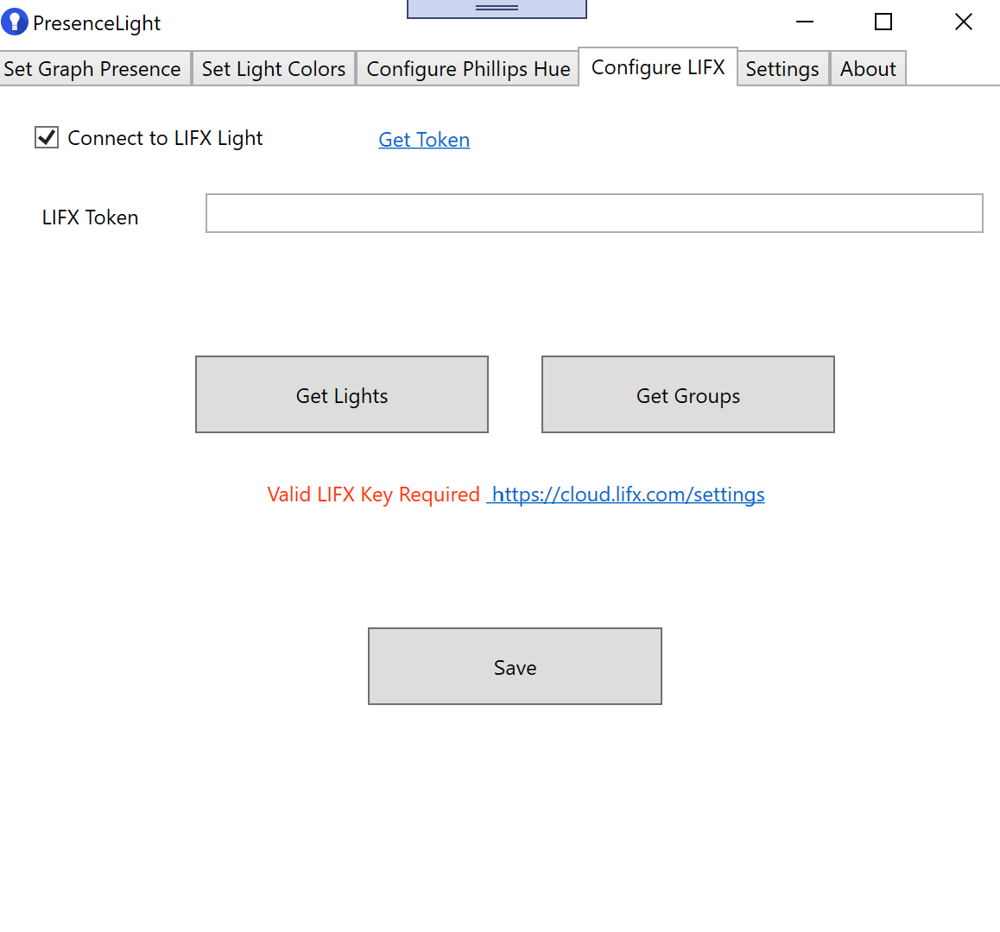
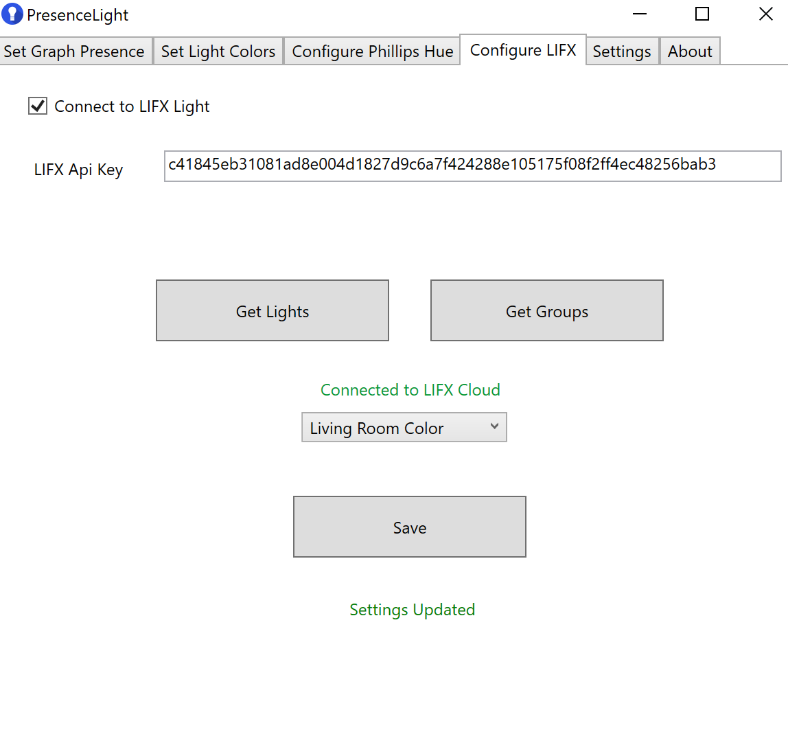

# PresenceLight - Desktop Version

## Desktop App Setup

**NOTE: These steps are for the WPF (Windows desktop client) application. If you want to get PresenceLight working on non-Windows, please take a look at the [Web Readme](web-README.md).**

### Install App

After you have followed installed the app, you will see a window like below

   

PresenceLight obtains your Microsoft Teams Availability using a multi-tenant Microsoft Entra ID Application, meaning you will need to "grant" access to your Presence the first time you use the app. Clicking sign-in will prompt you for a login with your Microsoft 365 credentials, and finally when authenticated, you will be shown your Graph profile image and your presence. If you are curious about what is required to do this on your own tenant, read [Configure an Entra ID Application](configure-entra-app.md)

   

The application "polls" the Presence Api at a configured value, which you can set between 1 and 5 seconds on the Settings page. This means that the light and app will update based on your Teams presence with a slight delay.

### Broadcasting to Lights

There are 2 ways to currently update your lights using PresenceLight

 - Updating with Teams Presence (status)
 - Setting a fixed color using color picker

You can only do one of these at a time, so if you for instance are syncing with Teams, choosing another option will sign you out of Teams. This will happen with the other options as well.

## Customize Icons

One of the features of PresenceLight is that you can minimize the app to the icon tray. When you open the app, you will see an icon similar to this.

   

This icon will represent your presence color. There are two "kinds" of icons: Transparent, and White. Here is the transparent icon

   

You can change the icon type in the settings pane.

   

After you change and save, the icon will update in the icon tray.

## Wire Up Philips Light

To connect PresenceLight to Philips Hue, you can do it 1 of 2 ways

 - Obtain the IP Address of your Philips Hue Bridge (if you have it)
 - Ask PresenceLight to find it for you (may no work in certain network configurations)

 

Once you have the IP of the bridge, you will need to register a developer account and get an Api Key. This is easily done by clicking the "Register Bridge" button. Clicking the button will popup a window asking you to press the sync button on the bridge, this is needed to register PresenceLight to the bridge.

 

When PresenceLight is configured, you will see a dropdown of Hue Bulbs connected to the bridge for you to set your presence to.

 

## Wire up LIFX

To connect PresenceLight to LIFX colored bulbs, you need to obtain a LIFX Developer Token. When you first arrive at the LIFX tab, you will see a message like this if you try to get Lights or Groups

 

After entering an obtained token, you will be able to get a list of either individual lights or groups of lights, selecting one of the options and saving gives you a message like this

 

## [Wire-up Custom API](configure-custom-api.md)

## In Conclusion

At this point PresenceLight should be setup. Feel free to file an issue if you have any problems.