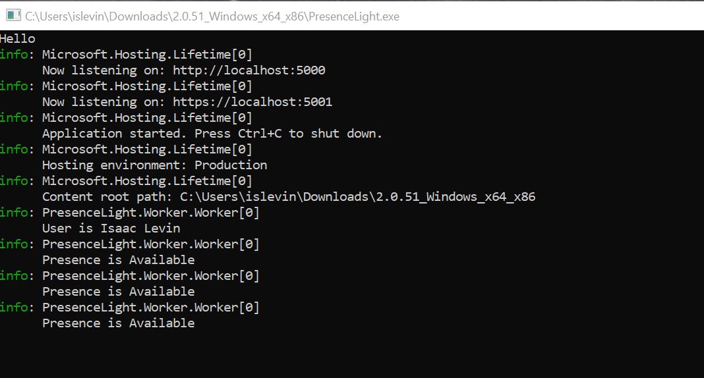
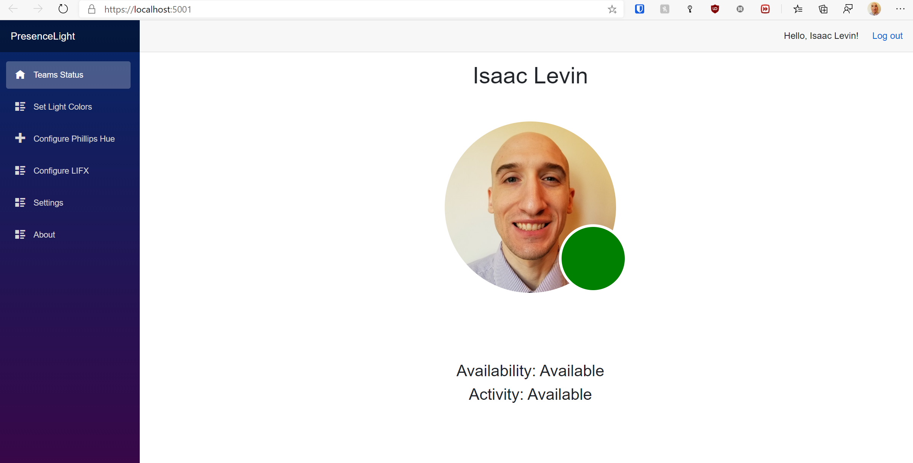

# PresenceLight - Worker Version


### Worker Version Installs

 Worker Download Site | Worker Container |
| ------- | ---------------   |
| [](https://presencelight.blob.core.windows.net/nightly/index.html) | [](https://hub.docker.com/r/isaaclevin/presencelight)  [](https://github.com/users/isaacrlevin/packages/container/package/presencelight) |

### App Setup
The cross platform version of PresenceLight runs as a .NET Core 5 single file executable application that runs a Server-Side Blazor Web Application and a ASP.NET Core Worker Service. The Blazor App is used as the mechanism to log the user in and configure settings of the app, while the Worker Service is responsible for interaction with Graph Api as well as the Smart Lights. This allows users to not need to have a UI version of the app open at all time, since the worker runs as a process. There is no installer for PresenceLight, so all that needs to be done is to download the zip folder from the [install site](http://presencelightapp.azurewebsites.net/), unzip, and run the .exe. At this point, a terminal window will open showing

 

Here you will the Url for the Kestrel hosted Web Application. Going to that Url will take you to web app, and will force a login to Azure Active Directory (for the Graph call). After login, you will see a similar look and feel to the client app.

 

 From here you can use PresenceLight in a similar way to the client app. You can enable and operate lights, push custom lights and configure polling. When done, you can close the browser and PresenceLight will continue to run in the background.

 To make the process even cleaner, you can configure a startup task to run the exe at startup, and PresenceLight will be available at the url listed the first time you ran it.

## Advanced Configuring
If you want to configure PresenceLight to use your own settings (maybe your own AAD, your own smart light registered app), you can do that by editing the appsettings.json

To do this in docker, just run the container once, and than stop and rerun by mounting the appsettings via a local volume.**

Log data and Configuration file will need to be written to a directory that has read/write enabled.   This is accomplished using
volumes.
```dotnetcli
volumes:
    /somedirectory:/app/config
```
When running under a container, logs will save to  /app/config/logs, and so will the dynamic PresenceLightSettings.json file.

If you need to customize your configuration.  Add/edit one or more of the necessary configuration files in this attached directory.

This will get you host access to the appsettings.json and PresenceLightSettings.json

There are some settings that you can modify per your needs them being

```json
"DeployedToServer": false, //If you don't want to run PresenceLight Locally, See SSL concerns below
"ServerIP": "", //see above
"DeployedToContainer": false // Running PresenceLight in docker requires a TLS
```

If you like, you can also supply your own SSL cert

```json
// If you use Certificate, make sure that the environment
// variables are not set, or they will overwrite these values
// - ASPNETCORE_Kestrel__Certificates__Default__Path
// - ASPNETCORE_Kestrel__Certificates__Default__Password

"Certificate": {
    "Path": "presencelight.pfx", // you can specify a relative path if you want your own certificate
    "Password": "presencelight" //password
  }
```


## Running in Docker

PresenceLight can easily be configured to run in a Docker container, and I have images on my [DockerHub](https://hub.docker.com/repository/docker/isaaclevin/presencelight) for the primary Linux distros.

- x64 Linux (latest tag)
- ARM64 (debian-arm64 tag)
- ARM32 (debian-arm32 tag) **This is the 4GB Raspberry Pi one**

For instance, here is a docker cli command to create a container with PresenceLight

**Note: You will need to create a directory to mount the app/Data volume BEFORE you create the container. This is where the SQLite DB will be created.**
```bash

docker run -d \
--name presencelight \
-e "ASPNETCORE_ENVIRONMENT=Development" \
-e "ASPNETCORE_URLS=http://+:80"  \
-e "TZ=America/Los_Angeles"
-p 8000:80 \
-p 4433:433 \
--restart unless-stopped \
isaaclevin/presencelight:latest

```
Or better yet, use docker-compose

```bash
version: '3.7'

services:
  presencelight:
    image: isaaclevin/presencelight:latest
    container_name: presencelight
    restart: unless-stopped
    environment:
      ASPNETCORE_URLS: "http://+:80"
      TZ: "America/Los_Angeles"
      ASPNETCORE_ENVIRONMENT: "Development"
    ports:
      - "8000:80"
      - "4433:433"
```

**NOTE: The TZ Environment Variable controls what TimeZone the container will run under. Not specifying this based on the [Timezone Database](https://en.wikipedia.org/wiki/List_of_tz_database_time_zones)
will make your likes not sync as desired.**

#### How are you handling SSL?

In order for PresenceLight to work, you need to have a redirect url to AAD
that is https. In order to make it easy for folks, I provided a self-signed
cert that will allow PresenceLight to do Https redirection out of the box.
Isaac is this secure? Weeeeeeelllll not the best, but since PresenceLight runs locally you should be fine. If you want to expose PresenceLight over the internet, it more than likely won't work as I have to register EACH redirect uri with Azure AD. Here is a list of registered Uris that you
can use.

- https://localhost:5001 (if you are running pure local)
- https://192.168.86.27:4433 (this is how I run docker)
- https://127.0.0.1:5001 (if for some reason you want to use loopback)

For my particular use-case I do not need SSL. WHAT?!?! Actually it is pretty cool. My personal setup is that PresenceLight runs in a docker container on a Raspberry Pi. I have Traefik, which is a well-known
reverse proxy that allows me to forward applications through my domain, so I can access the application from anywhere by going to

presencelight.mydomain.com

The best part about this is that [Traefik](https://traefik.io/) can be configured to pull LetsEncrypt Certificates and integration with CloudFlare SSL. There is a [great blog post on this](https://www.smarthomebeginner.com/traefik-2-docker-tutorial/), that I highly reccomend if you are interested.

If you want SSL for your implementation, but don't want to use a reverse proxy, you can easily obtain a certificate with either

- dotnet dev-certs
  - dotnet dev-certs https -ep %PATHTOYOURCERT%\my_web_domain.pfx -p crypticpassword
  - dotnet dev-certs https --trust
- openssl (Linux)
  - [Go here make your life easier](https://www.digicert.com/easy-csr/openssl.htm)
  - openssl x509 -signkey my_web_domain.key -in my_web_domain.csr -req -days 365 -out my_web_domain.crt
  - openssl pkcs12 -inkey my_web_domain.key -in my_web_domain.crt -export -out %PATHTOYOURCERT%my_web_domain.pfx

**[Doc on subject](https://docs.microsoft.com/dotnet/core/additional-tools/self-signed-certificates-guide)**

Once you have a valid .pfx file, you will need to wire up the app to use that cert, the way you do that depends on how you host your app. If you app is just running locally on the machine,
you can just set environment variables for your app.

- ASPNETCORE_Kestrel__Certificates__Default__Path
- ASPNETCORE_Kestrel__Certificates__Default__Password

Or if you are running in docker, you will need to mount a volume that has your cert in it like so

**docker-compose example**

```bash
ports:
  - 8000:80
  - 8001:443
environment:
  ASPNETCORE_URLS: "https://+:443;http://+:80"
  ASPNETCORE_Kestrel__Certificates__Default__Password: "YourSecurePassword"
  ASPNETCORE_Kestrel__Certificates__Default__Path: "my_web_domain.pfx"
```

For this to work, your cert will need to be at the same level as the exe file.There are better ways to do this, but this is the easiest to get started.

### Third Party Libraries

PresenceLight would not be possible without the amazing work from the contributors to the following third party libraries!

- [Blazored.Modal](https://github.com/Blazored/Modal)
- [Blazorise](https://github.com/stsrki/Blazorise)
- [IdentityModel.OidcClient](https://github.com/IdentityModel/IdentityModel.OidcClient)
- [Newtonsoft.Json](https://github.com/JamesNK/Newtonsoft.Json)
